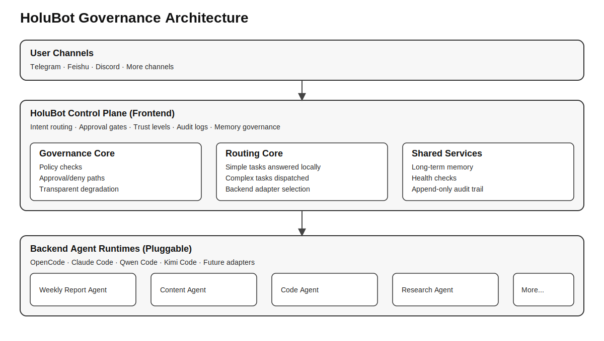

# HoluBot

**36% of AI agent skills have security flaws.**  
HoluBot is a governance and dispatch layer that sits in front of AI agents: audit, approve, and control before they act.

HoluBot is not another all-in-one agent framework. It is a lightweight control plane for routing, trust gating, memory governance, and auditable execution across multiple agent backends.

## Quick Start

This repository is in **docs-first open-source stage**.

- Read the sanitized whitepaper: [`docs/WHITEPAPER_ZH.md`](docs/WHITEPAPER_ZH.md)
- Check minimal agent spec and example: [`examples/`](examples/)
- Runnable release is coming soon. Star this repo to follow progress.

## Why HoluBot

- Governance-first: approval gates, audit logs, trust levels
- Cost-aware routing: lightweight frontend, heavyweight backend only when needed
- Backend-pluggable: route to different agent runtimes via adapter abstraction

## Project Status

- Stage: early public preview (documentation + specs + examples)
- Scope today: architecture, principles, agent contract, roadmap-aligned artifacts

## License

[MIT](LICENSE)
