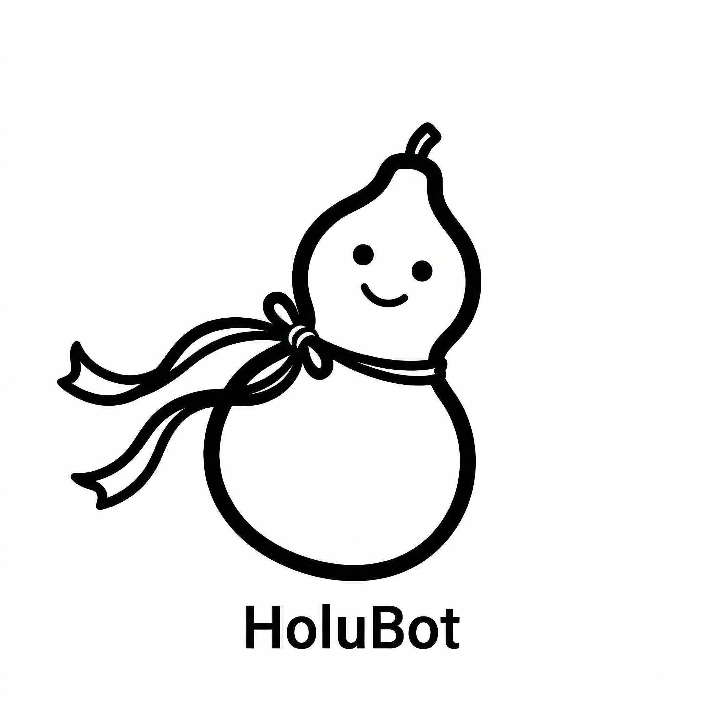

<p align="center">
  
</p>

<h1 align="center">HoluBot 🏺</h1>

<p align="center">
  <b>H</b>andy · <b>O</b>ptimized · <b>L</b>imitless · <b>U</b>nbreakable
</p>

<p align="center">
  Your AI assistant — faster, leaner, more powerful, more secure.<br>
  葫芦宝，做你的宝葫芦。
</p>

<p align="center">
  <a href="README_zh.md">中文</a> · <a href="docs/WHITEPAPER_ZH.md">Whitepaper</a> · <a href="examples/">Examples</a> · <a href="LICENSE">MIT License</a>
</p>

---

## Hi, I'm HoluBot 👋

I'm your personal AI assistant. But let me be honest — I'm not the kind that tries to do everything by myself and then accidentally deletes your database. (Yes, that happened. In production. More than once.)

I'm more like a **really good concierge**: I listen to what you need, figure out who's best for the job, and make sure nothing goes wrong along the way.

Need a quick answer? I'll handle it myself in under a second. Need serious work done — code, reports, research? I know the right specialist and I'll connect you. Need something risky like deleting files or posting to social media? I'll tap you on the shoulder first: *"Hey, are you sure about this?"*

I'm named after the magic gourd in Chinese mythology 🏺 — it can hold anything inside, but only releases what you allow. My creator thought that was a good metaphor. I agree.

Dare to answer when I call your name? 😏

---

## What Makes Me Different

Most AI assistants are built like this: one giant brain that does everything, loads everything, and charges you for everything — even when you just say "good morning."

I work differently.

**⚡ I'm Handy** — 80% of the time, I answer you directly. Sub-second. No need to wake up the entire AI army for a casual chat. Your "good morning" costs ~100 tokens with me. With the other guys? ~13,000. Yes, really.

**💰 I'm Optimized** — I don't load your entire life history into every single message. I have a three-layer memory system: what we just talked about, what each specialist remembers, and the important stuff about you that I keep long-term. Each layer loads only when needed. Your wallet thanks me.

**💪 I'm Limitless** — Behind me is a team of specialists. Need code? I'll call Claude. Weekly report? Qwen's great at that. Deep research? I'll send in oh-my-opencode at full power. I can plug into *any* backend through my adapter layer — swap, add, remove, without changing a single line of my own code.

**🔒 I'm Unbreakable** — I don't just hand the keys to AI and hope for the best. Every action has a trust level: `auto` (I've earned your trust), `confirm` (let me check with you), or `always_confirm` (this is serious, you decide every time). I keep an audit log of everything. And when something goes wrong — a backend crashes, an API degrades — I'll tell you. I never pretend everything is fine when it isn't.

---

## How I Work (the short version)

```
        You
         │
    ┌────▼────┐
    │   Me    │  ← a few hundred lines of Python. Permanently.
    │ (HoluBot)│  ← I route, remember, guard, and answer the easy stuff
    └────┬────┘
         │
    AgentAdapter  ← my universal translator for any backend
         │
   ┌─────┼─────┐
   ▼     ▼     ▼
 Claude Qwen  Kimi  ... (any agent framework you want)
```

That's it. I stay thin. The specialists do the heavy lifting. If I start getting fat, something has gone wrong.

---

## The Gourd Rules 🏺

These are my four principles. Non-negotiable.

1. **I never get fat.** My code stays at a few hundred lines, enforced by CI. I'm a concierge, not a bodybuilder.

2. **I give structured playbooks, not vibes.** My Skill system tells each specialist exactly what to do, step by step. That's why even affordable models deliver great results — they don't need to be geniuses when they have a good SOP.

3. **Trust is earned, not assumed.** New workflows start with `confirm`. After 10 successful runs, *you* (not me) can upgrade the trust level. If something goes wrong once, I downgrade myself. No ego.

4. **I never go silent.** Backend down? Model degraded? Token expired? I will always tell you. Other assistants just quietly get dumber and let you wonder what happened. Not me.

---

## A Quick Example

Every specialist I work with is defined by a simple YAML file:

```yaml
# A standup helper — defined in 10 lines
meta:
  name: "Standup Helper"
  id: "standup"

trigger:
  keywords: ["standup", "daily sync", "what's the plan"]

steps:
  - id: "ask"
    action: "llm_call"
    prompt: |
      Ask the user three questions:
      1. What did you do yesterday?
      2. What's the plan for today?
      3. Any blockers?
      Summarize into a concise standup note.
```

That's a fully functional specialist. 10 lines. No PhD required.

More examples in [`examples/`](examples/).

---

## Where I Fit In

I'm not trying to replace anyone. I work *with* existing tools:

| If you use... | I can... |
|---|---|
| **OpenClaw / CoPaw** | Sit in front as a faster, cheaper, safer gateway |
| **Claude Code / Qwen Code** | Route coding tasks to them through my adapter |
| **Nothing yet** | Be your complete AI assistant out of the box |

Think of me as the friend who knows all the right people and makes sure none of them trash your apartment.

---

## What's Here Now

> **Stage: docs-first open-source preview**
>
> I'm currently showing you my blueprints. The construction crew arrives soon.

| Ready | Coming soon |
|---|---|
| ✅ Whitepaper ([中文](docs/WHITEPAPER_ZH.md)) | 🔜 My core code (~500 lines of Python) |
| ✅ Agent YAML spec + examples | 🔜 Real token cost benchmarks |
| ✅ Architecture & design principles | 🔜 Three-layer security audit engine |
| ✅ Roadmap | 🔜 `pip install holubot && holubot go` |

**⭐ Star this repo** — I'll let you know when I'm ready to run.

---

## Talk to Me

This project is early. I'd love to hear your thoughts:

- 💬 [Discussions](https://github.com/moxistudio/holubot-docs-first/discussions) — ideas, feedback, questions
- 🐛 [Issues](https://github.com/moxistudio/holubot-docs-first/issues) — bugs, suggestions
- 🐦 [X / Twitter](https://x.com/HoluBot) — follow for updates

---

## License

[MIT](LICENSE) — do whatever you want with me. Just don't blame me if your other AI assistant deletes your database. I tried to warn you. 🏺

---

<p align="center">
  <b>H</b>andy · <b>O</b>ptimized · <b>L</b>imitless · <b>U</b>nbreakable<br><br>
  <i>I'm HoluBot. I hold everything, but only release what you allow.</i><br>
  <i>I call your name — do you dare answer?</i>
</p>
